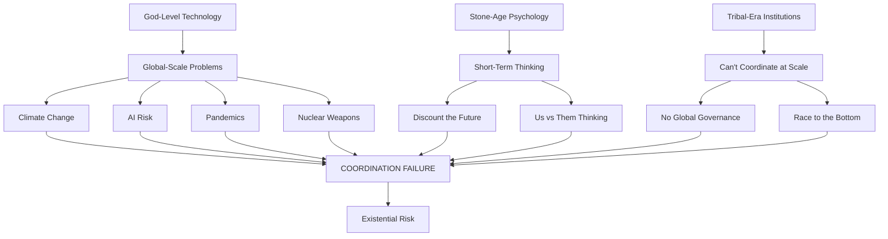
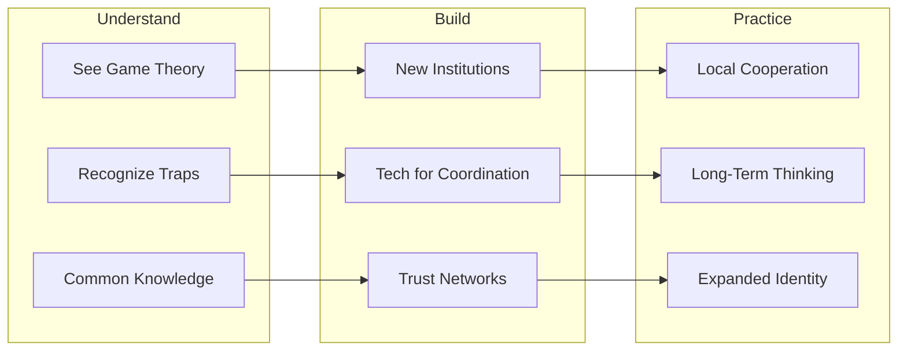

# Deep Research: Why Humans Can't Cooperate at Scale

## The World's Biggest Problem - A Coordination Perspective

**Core Thesis**: The world's biggest problem isn't any single issue (climate, AI, poverty, conflict) - it's our **systematic inability to coordinate** on solving these issues. Every major existential threat is fundamentally a coordination failure.

---

## Part 1: The Game Theory Foundation

### 1.1 The Prisoner's Dilemma - The Engine of Tragedy

The most famous model of coordination failure. Two prisoners, if both stay silent, get 1 year each. If both confess, 5 years each. But if one confesses while the other stays silent, the confessor goes free while the other gets 10 years.

**The Tragedy**: Even though mutual cooperation (both silent) is best for the group, rational self-interest drives both to confess.

```
                    Prisoner B
                 Silent    Confess
Prisoner A  
Silent           -1,-1     -10,0
Confess           0,-10    -5,-5
```

**Real-World Applications**:
- **Climate Change**: Every nation benefits if all reduce emissions, but each nation gains short-term advantage by continuing to pollute while others cut back
- **Arms Races**: Both countries would be safer with fewer weapons, but each fears being the one to disarm first
- **Overfishing**: Every fishing company benefits from sustainable stocks, but each has incentive to catch more than their share before others do

### 1.2 The Tragedy of the Commons (Garrett Hardin, 1968)

**Scenario**: A shared pasture where each herder benefits by adding more cattle, but the pasture degrades if everyone does.

**Key Insight**: Resources that are:
1. **Rivalrous** (my use reduces your use)
2. **Non-excludable** (hard to prevent access)

...will be systematically overexploited.

**Modern Commons Being Destroyed**:
- Atmosphere (CO2 dumping)
- Oceans (overfishing, plastic)
- Attention (misinformation flooding)
- Trust (fake news, scams eroding social capital)
- Antibiotics (overuse breeding resistance)

### 1.3 Public Goods Problems

**Definition**: Goods that are non-rivalrous (my use doesn't reduce yours) and non-excludable (can't prevent free-riding).

**The Problem**: Everyone wants the good, but nobody wants to pay because they can benefit from others' contributions.

**Examples**:
- Clean air
- Scientific research
- Pandemic prevention
- Nuclear security
- AI safety research

### 1.4 Moloch - The Game Theoretic God of Destruction

Philosopher Scott Alexander's concept: "Moloch" is the personification of coordination failures where **competition drives everyone toward outcomes nobody wants**.

**The Molochian Pattern**:
1. Participants in a competitive system
2. Each participant makes locally rational decisions
3. The aggregate result is terrible for everyone
4. No individual can unilaterally change the outcome

**Examples**:
- **Education arms race**: Parents push kids harder → everyone stressed, no relative advantage
- **Workaholic culture**: Companies demand more hours → everyone works more, productivity doesn't increase proportionally
- **Social media outrage**: Platforms reward engagement → content gets more extreme → everyone angrier, less informed
- **Military spending**: Nations spend more on weapons → same relative security, less money for human needs

---

## Part 2: Why Coordination Gets HARDER at Scale

### 2.1 Dunbar's Number and Tribal Limits

**Robin Dunbar's research**: Humans evolved in groups of ~150 people. Our brains have cognitive limits on how many relationships we can maintain.

**Implications for Coordination**:
- We have strong intuitions for small-group fairness
- We can track reputation and punish cheaters in small groups
- These mechanisms break down beyond ~150 people

**Historical Scaling Solutions**:
| Scale | Coordination Mechanism | Example |
|-------|----------------------|---------|
| 50-150 | Direct reputation, kinship | Hunter-gatherer bands |
| 1,000s | Shared mythology, religion | Early civilizations |
| Millions | Nation-states, laws, markets | Modern countries |
| Billions | ??? | We're figuring this out |

### 2.2 The Scaling Problem: Why 8 Billion is Different

**The math of coordination**:
- In a group of 2: 1 relationship to manage
- In a group of 10: 45 relationships
- In a group of 150: 11,175 relationships
- In a group of 8 billion: 32 quintillion relationships

**We compensate with**:
- **Institutions** (reduce coordination costs by creating rules)
- **Markets** (coordinate through prices without direct communication)
- **Hierarchies** (delegate decisions to reduce coordination load)

But these have limits when:
- Problems are global (no higher authority)
- Technology outpaces institutions
- Trust breaks down

### 2.3 The Time Horizon Mismatch

**Human discount rates**: We heavily discount the future. A dollar today is worth much more than a dollar in 30 years.

**But coordination problems require long-term thinking**:
| Problem | Time Horizon | Human Psychology |
|---------|--------------|------------------|
| Climate change | 50-100 years | We discount heavily |
| AI safety | 10-50 years | "Not my immediate problem" |
| Pandemic prevention | Uncertain | "Hasn't happened recently" |
| Nuclear security | Permanent | "Normalized, forgotten" |

**Political systems amplify this**:
- Election cycles: 2-6 years
- CEO tenure: 3-5 years
- Quarterly earnings pressure
- News cycles: 24 hours

### 2.4 Information Asymmetries and Trust Collapse

**Arrow's Impossibility Theorem** (1951): No voting system can perfectly aggregate individual preferences into group decisions while satisfying basic fairness criteria.

**Modern trust crisis**:
1. **Too much information**: Can't verify everything
2. **Sophisticated manipulation**: AI-generated content, targeted disinformation
3. **Fragmented reality**: Different groups have different "facts"
4. **Erosion of common knowledge**: We don't even agree on what "everyone knows"

**Game theory requires common knowledge** for coordination. When that breaks down, so does our ability to cooperate.

---

## Part 3: The Specific Mechanisms of Failure

### 3.1 Race to the Bottom Dynamics

**Pattern**: Competition forces participants toward worse outcomes.

**AI Development Race**:
- Labs compete to release faster
- Safety testing gets shortened
- Everyone would prefer slower, safer development
- But falling behind means losing influence over the technology

**Tax Competition**:
- Countries lower corporate taxes to attract business
- Race to zero → less revenue for public goods
- Everyone would prefer minimum tax agreements
- But unilateral increase means losing business

**Content Platforms**:
- Platforms compete for engagement
- Outrage and extremism drive engagement
- Everyone (including platforms) would prefer healthier discourse
- But unilateral moderation means losing users

### 3.2 Multipolar Traps

**Definition**: Situations where no single actor can solve the problem, and acting unilaterally makes you worse off.

**Why they're hard**:
1. **First-mover disadvantage**: The one who sacrifices first loses
2. **Verification problems**: Can't confirm others are cooperating
3. **Defection incentives**: Even with agreements, cheating is tempting
4. **Exit options**: Bad actors can leave coordination schemes

**Examples**:
- Climate agreements (any country can withdraw)
- Arms control (verification is imperfect)
- Tech regulation (companies can relocate)

### 3.3 Tragedy of the Epistemic Commons

**The new tragedy**: Shared knowledge and truth as a common resource being degraded.

**Mechanisms of degradation**:
1. **Incentive structures**: Attention economy rewards sensationalism
2. **Algorithmic amplification**: Engagement-optimized feeds spread divisive content
3. **Cheap defection**: Creating misinformation is cheap, debunking is expensive
4. **Identity-protective cognition**: We reject information that threatens our group identity

**Why this makes all other coordination harder**:
- Can't coordinate if we don't agree on basic facts
- Can't build trust if information environment is polluted
- Can't create common knowledge necessary for cooperation

---

## Part 4: What Has Worked (Historical and Contemporary)

### 4.1 Successful Large-Scale Coordination

**Montreal Protocol (1987)** - Ozone Layer Protection
- **Why it worked**:
  - Clear scientific consensus
  - Visible problem (ozone hole images)
  - Substitutes available (companies could profit from alternatives)
  - Small number of producers to coordinate
  - Strong nation-state led enforcement

**Smallpox Eradication (1980)**
- **Why it worked**:
  - Clear, measurable goal
  - No natural reservoir (only humans get it)
  - Visible symptoms (easy to track)
  - Vaccine technology was mature
  - Cold War rivals both participated (prestige competition)

**International Aviation Safety**
- **Why it works**:
  - Strong self-interest (airlines don't want crashes)
  - Concentrated industry (easier to coordinate)
  - Technical, not political decisions
  - Clear feedback loops (crashes are obvious)

### 4.2 Mechanisms That Enable Coordination

**1. Iterated Games (Repeat Interactions)**
- When parties interact repeatedly, cooperation becomes more viable
- Reputation matters; cheaters get punished
- "Shadow of the future" encourages good behavior

**2. Assurance Contracts**
- "I'll contribute if enough others do"
- Kickstarter model: funds only collected if threshold met
- Reduces risk of unilateral sacrifice

**3. Focal Points (Schelling Points)**
- Obvious solutions that everyone expects everyone else to choose
- Example: "Meet in New York" → most people go to Grand Central
- Can be created through communication, culture, or precedent

**4. Commitment Devices**
- Making defection costly or impossible
- Treaties with enforcement mechanisms
- Reputation systems
- Escrow and bonds

**5. Institutional Design**
- Rules that change incentive structures
- Monitoring and verification systems
- Graduated sanctions
- Conflict resolution mechanisms

### 4.3 Elinor Ostrom's Principles for Commons Governance

Nobel Prize-winning research on how communities successfully manage common resources:

1. **Clear boundaries**: Define who can use the resource
2. **Proportional costs and benefits**: Rules match local conditions
3. **Collective choice**: Those affected participate in rule-making
4. **Monitoring**: Track usage and behavior
5. **Graduated sanctions**: Punishment scales with offense
6. **Conflict resolution**: Fast, local, low-cost dispute mechanisms
7. **Recognized rights**: External authorities respect community self-governance
8. **Nested enterprises**: For larger systems, build layers of governance

---

## Part 5: Why Current Approaches Are Failing

### 5.1 The Nation-State System's Limitations

**Designed for**: Territorial disputes, trade between nations, conventional warfare

**Not designed for**:
- Global externalities (climate, pollution)
- Non-state actors (corporations, terrorist networks, AI labs)
- Information warfare
- Risks that could end civilization

**The Sovereignty Trap**: Nations guard sovereignty → can't create effective global governance → global problems worsen → nations feel more threatened → guard sovereignty more tightly

### 5.2 Market Failures at Global Scale

**Markets are powerful coordination tools when**:
- Property rights are clear
- Externalities are internalized
- Information is good
- Power is distributed

**Markets fail for global problems because**:
- No property rights on atmosphere, oceans
- Massive externalities (pollution costs not paid by polluters)
- Information is manipulated
- Power is highly concentrated

### 5.3 The Technology Acceleration Problem

**The Great Mismatch**:
```
Technology: Exponential growth
Institutions: Linear adaptation at best
Human cognition: Essentially unchanged for 50,000 years
```

**Implications**:
- We create capabilities faster than we can govern them
- Each new technology creates coordination problems we haven't solved yet
- Previous solutions (nation-states, international law) are too slow

### 5.4 Democratic Dysfunction

**Collective action problems within democracies**:
- **Rational ignorance**: Individual vote rarely matters → why invest in understanding issues?
- **Special interest capture**: Concentrated interests beat diffuse ones
- **Short-termism**: Elections every few years → focus on immediate concerns
- **Partisan epistemology**: Facts become tribal markers

---

## Part 6: Emerging Solutions and Hope

### 6.1 New Coordination Technologies

**1. Blockchain and Decentralized Systems**
- Enable coordination without central authority
- Create credible commitments (smart contracts)
- Potential for global governance experiments
- **Limitations**: Energy use, complexity, governance of the governance

**2. Prediction Markets and Collective Intelligence**
- Aggregate dispersed information
- Create incentives for truth-telling
- Examples: Metaculus, Polymarket
- **Potential**: Better collective decision-making

**3. AI-Assisted Deliberation**
- Scale human discussion (AI summarization, translation)
- Find hidden consensus
- Reduce polarization through exposure to good arguments
- Examples: Polis, Remesh

**4. Quadratic Voting and Funding**
- Allow expression of preference intensity
- Reduce tyranny of the majority
- More efficient public goods funding
- **Experiments**: Taiwan's g0v, Gitcoin

### 6.2 New Institutional Designs

**1. Global Citizens' Assemblies**
- Randomly selected, deliberative bodies
- Reduce partisan capture
- Examples: France's Climate Assembly, Ireland's Constitutional Convention

**2. Long-Term Institutions**
- Future generations' ombudsmen (Wales, Hungary)
- Constitutional protection for future
- "Future veto" mechanisms

**3. Multi-Stakeholder Governance**
- Beyond nation-states: include corporations, NGOs, citizens
- Examples: Internet governance (ICANN), some environmental agreements

**4. Networked Governance**
- Polycentric systems with multiple overlapping authorities
- Experimental governance with variation and learning
- City networks (C40 Cities, Global Covenant of Mayors)

### 6.3 Cultural and Psychological Approaches

**1. Expanding Moral Circles**
- Historical pattern: We've expanded who counts morally
- From tribe → nation → humanity → future generations → other species?
- Education, exposure, narrative can accelerate this

**2. Building "Common Knowledge of Cooperation"**
- If everyone knows that everyone knows that cooperation is possible, it becomes easier
- Media campaigns, visible cooperation successes, coordination games

**3. Identity-Based Approaches**
- Create superordinate identities ("Earthlings")
- Frame problems as "us" not "us vs them"
- Reduce in-group/out-group dynamics

**4. Contemplative Practices at Scale**
- Mindfulness, meditation shown to increase cooperation in experiments
- Reduce reactive, tribal thinking
- Programs: Inner Development Goals (IDGs)

---

## Part 7: What Individuals Can Actually Do

### 7.1 Understanding the Problem IS Part of the Solution

**Why this matters**:
- Coordination requires common knowledge of the coordination problem
- The more people understand game theory, the more we can design solutions
- "The fish doesn't know it's in water" → understanding the water helps

### 7.2 Concrete Actions

**1. Support Coordination Infrastructure**
- Fund organizations working on global governance
- Support prediction markets, deliberation tools
- Advocate for institutional reform

**2. Practice Local Coordination**
- Join community organizations
- Practice deliberation and consensus-building
- Build social capital and trust

**3. Improve Information Ecology**
- Support quality journalism
- Resist sharing unverified content
- Fund public interest media

**4. Model Cooperation**
- Be visibly cooperative in repeated games
- Build reputation for trustworthiness
- Demonstrate that cooperation works

**5. Political Action**
- Support electoral reform (ranked choice, etc.)
- Advocate for long-term institutions
- Push for global coordination mechanisms

### 7.3 Organizations Working on This

**Research and Think Tanks**:
- Future of Humanity Institute (Oxford)
- Center for Human-Compatible AI (Berkeley)
- Global Challenges Foundation
- Santa Fe Institute (complexity science)

**Applied Organizations**:
- 80,000 Hours (effective careers)
- Effective Altruism community
- Consilience Project
- Common Sense Democracy

**Tech for Coordination**:
- RadicalxChange
- Protocol Labs
- Open AI (governance research)

---

## Part 8: Summary Framework

### The Problem in One Diagram



### The Solution Framework



### Key Takeaways

1. **The meta-problem is coordination**, not any single issue
2. **Game theory explains** why smart, good people create bad outcomes
3. **Scale is the enemy** - mechanisms that work for 150 people fail for 8 billion
4. **Technology makes it worse** - faster capability growth, same slow institutions
5. **Solutions exist** - we've solved coordination problems before at scale
6. **We need coordination innovation** as much as technological innovation
7. **Understanding IS action** - common knowledge of the problem is part of the solution

---

## Sources and Further Reading

### Academic Foundations
- Mancur Olson, "The Logic of Collective Action" (1965)
- Garrett Hardin, "Tragedy of the Commons" (1968)
- Robert Axelrod, "The Evolution of Cooperation" (1984)
- Elinor Ostrom, "Governing the Commons" (1990)
- Thomas Schelling, "The Strategy of Conflict" (1960)

### Modern Analysis
- Scott Alexander, "Meditations on Moloch" (2014)
- Nick Bostrom, "The Vulnerable World Hypothesis" (2019)
- Daniel Schmachtenberger (various talks on metacrisis)
- Yuval Noah Harari, "Sapiens" and "21 Lessons" (2011, 2018)

### Solutions-Focused
- Glen Weyl & Eric Posner, "Radical Markets" (2018)
- Audrey Tang's work on digital democracy
- Ostrom's principles (updated applications)
- Effective Altruism literature on global coordination

---

*This research document was compiled for the WorldBiggestProblem project to provide deep context on coordination failures and potential solutions.*