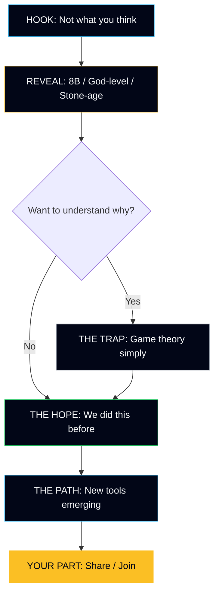

# The Final Story: Ultra-Simple, Maximum Impact

## The Core Message (3 Sentences)

> **8 billion people. God-level tools. Stone-age coordination.**
>
> Every crisis — climate, AI, pandemics — is the same problem: we can't cooperate as fast as we can create.
>
> The good news? We've solved this before. We can solve it again.

---

## The 5-Screen Story

### SCREEN 1: THE HOOK

**Visual**: Dark space, Earth emerging, single spotlight

**Text**:
```
THE WORLD'S BIGGEST PROBLEM
IS NOT WHAT YOU THINK

↓
```

**Design Notes**:
- Minimal, cinematic
- Text reveals slowly on scroll
- Creates curiosity gap
- 3 seconds to understand

---

### SCREEN 2: THE REVEAL

**Visual**: The "Coordination Gap" graphic — technology line soaring, coordination line lagging

**Text**:
```
Climate change.
Artificial intelligence.
Pandemics.
Nuclear weapons.

They look like different problems.
They're not.

They're all the same problem:

8 billion people
God-level tools
Stone-age coordination
```

**Design Notes**:
- Each crisis appears, then fades
- The "same problem" line is the reveal
- Final 3 lines are LARGE, memorable
- This is the most quotable/shareable screen

---

### SCREEN 3: THE TRAP (Optional — can be cut for even simpler version)

**Visual**: Simple animation of Prisoner's Dilemma or Race to Bottom

**Text**:
```
WHY IS THIS SO HARD?

Every nation wants a clean planet.
But each fears being the only one to sacrifice.

Every AI lab wants safety.
But each fears falling behind.

It's not that humans are bad.
It's that we're stuck in a trap.

But traps can be escaped.
```

**Design Notes**:
- Keep this SHORT
- Game theory explained without jargon
- End with hope ("traps can be escaped")

---

### SCREEN 4: THE HOPE

**Visual**: Grid of success stories with checkmarks, or timeline of victories

**Text**:
```
WE'VE DONE THIS BEFORE

✓ The ozone layer was dying.
   In 1987, every nation agreed to fix it.
   It's healing now.

✓ Smallpox killed 300 million in the 20th century.
   In 1980, we eliminated it forever.
   Even Cold War enemies cooperated.

✓ Europe fought wars for centuries.
   Since 1945, the longest peace in history.
   
Coordination is a skill.
We're getting better at it.
```

**Design Notes**:
- GREEN color for success/hope
- Each victory is a mini-story
- The pattern is clear: we CAN coordinate when we try
- End line is the takeaway

---

### SCREEN 5: THE PATH

**Visual**: Emerging tools as icons or cards

**Text**:
```
NEW TOOLS ARE EMERGING

🗣️ AI helping us talk to millions at once
   (Taiwan's digital democracy)

⚖️ New ways to fund public goods fairly
   ($50M+ distributed by Gitcoin)

🏛️ Citizens' assemblies that actually work
   (Ireland, France, and growing)

📈 Renewable energy now CHEAPER than fossil fuels
   (The economics have flipped)

The gap is closing.
```

**Design Notes**:
- BLUE color for innovation
- Each tool is a reason for hope
- Keep examples concrete but brief
- "Gap is closing" echoes the visual from Screen 2

---

### SCREEN 6: YOUR PART

**Visual**: Warm invitation, possibly hands reaching or bridge connecting

**Text**:
```
YOU CAN HELP CLOSE THE GAP

Three things that matter:

1️⃣ UNDERSTAND THE PATTERN
   You just did. Now you see it everywhere.

2️⃣ SHARE THIS STORY
   Common knowledge of the problem
   is part of the solution.

3️⃣ JOIN THE MOVEMENT
   Millions are already working on this.
   Here's how to find them.

[SHARE THIS] [JOIN US]
```

**Design Notes**:
- GOLD/AMBER color for call to action
- Only TWO clear buttons
- "Join the movement" language (not "save the world")
- Emphasize they're joining something already working

---

## The Visual Language

### Color Palette

| Color | Hex | Use |
|-------|-----|-----|
| Deep Space | #020617 | Background, seriousness |
| Hope Green | #22c55e | Success stories, solutions |
| Innovation Blue | #38bdf8 | Tools, technology, future |
| Urgent Amber | #fbbf24 | Highlights, CTAs |
| Clean White | #f9fafb | Text, clarity |
| Muted | #9ca3af | Secondary text |

### Typography

- **Headlines**: Bold, max 8 words, punchy
- **Body**: 16-18px, readable, short paragraphs
- **Key Phrases**: Slightly larger, emphasized
- **"The Quote"**: One ultra-memorable line per screen

### Animations (Subtle)

- Fade-in on scroll (content appears as you reach it)
- The gap graphic could animate (lines diverging, then converging)
- Checkmarks appear with slight bounce
- Buttons have subtle hover states

---

## The Shareables

### For Twitter/X (280 chars)

> Every crisis — climate, AI, pandemics — is the same problem: 8 billion people with god-level tools and stone-age coordination. The good news? We've solved this before. [link]

### For LinkedIn/Facebook (Longer)

> The world's biggest problem is not climate change. It's not AI. It's not pandemics.
>
> It's that these are all the SAME problem: 8 billion people sharing one planet, with god-level technology and stone-age coordination.
>
> But here's what gives me hope: We've solved coordination problems before. We fixed the ozone layer. We eliminated smallpox. We ended European wars.
>
> Coordination is a skill. We're getting better at it. And you can be part of it.
>
> [link]

### For Instagram/Visual

Simple image with text:
```
8 billion people.
God-level tools.
Stone-age coordination.

↓

The good news?
We've solved this before.
```

---

## One-Page Summary for Implementation

### What to Keep from Current Site
- The dark, cinematic visual style
- The "meta-crisis" framing (but simplify it)
- The section structure (but reduce to 5-6 screens)
- The hopeful tone in footer

### What to Change
- Lead with success stories BEFORE explaining the problem
- Simplify the game theory (or cut it entirely for v1)
- Make "8 billion / god-level / stone-age" the memorable tagline
- Reduce the "solutions" to proof of concept (not comprehensive list)
- Single clear CTA at the end

### Implementation Phases

**Phase 1: Core Story (MVP)**
- Screens 1, 2, 4, 6 only (Hook, Reveal, Hope, Action)
- Skip the trap explanation for now
- Test if the simple version works

**Phase 2: Add Depth**
- Add Screen 3 (The Trap) for those who want to understand WHY
- Add Screen 5 (The Path) for more specific hope

**Phase 3: Interactive**
- Make the gap visualization animated
- Add scroll-triggered reveals
- Consider adding a simple game (experience the Prisoner's Dilemma)

---

## The Mermaid Diagram: Story Flow



---

## Success Metrics

| Metric | Target | Why It Matters |
|--------|--------|----------------|
| Time to scroll | < 2 minutes | Whole story consumed |
| Scroll depth | > 80% | People reach the CTA |
| Share rate | > 5% | Story is spreading |
| Quote memorability | High | "8 billion / god-level / stone-age" remembered |

---

## Ready for Code Mode

This story structure is ready to implement. When you approve:

1. **Phase 1**: Build the 4-screen MVP (Hook → Reveal → Hope → Action)
2. **Phase 2**: Add depth screens (Trap → Path)
3. **Phase 3**: Polish animations and shareables

The simpler version (4 screens) can be built in a single session.

---

*This is the distillation of all research into a single, implementable story structure designed for maximum reach and impact.*