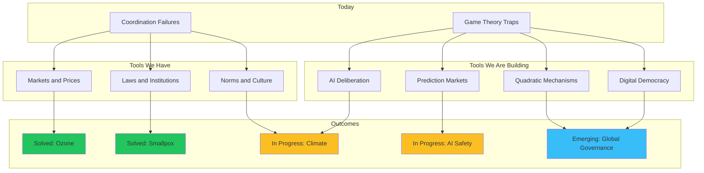

# Solutions and Hope: How Humans ARE Learning to Coordinate

## The Optimistic Reframe

**Core Message**: Coordination failures are **design problems, not destiny**. We've solved them before at enormous scale. We're solving them now. And we have more tools than ever.

---

## Part 1: The Track Record of Progress

### Coordination Problems We've Already Solved

#### 1. The Ozone Layer — Total Victory
**The Problem**: CFCs were destroying the ozone layer, risking mass skin cancer and ecosystem collapse.

**The Solution**: Montreal Protocol (1987) — every nation on Earth agreed to phase out CFCs.

**The Result**: 
- 99% reduction in ozone-depleting substances
- The ozone layer is measurably healing
- Will fully recover by 2050-2070

**Why This Worked**:
- Clear science with dramatic imagery (ozone hole photos)
- DuPont and other companies saw profit in alternatives
- Small number of producers made coordination easier
- Strong verification and enforcement mechanisms
- Graduated timeline gave everyone time to adapt

**Key Lesson**: When the problem is visible, solutions are profitable, and the number of key actors is manageable — we can coordinate globally.

---

#### 2. Smallpox Eradication — Humanity United
**The Problem**: Smallpox killed an estimated 300 million people in the 20th century alone. It had plagued humanity for 3,000 years.

**The Solution**: A coordinated global vaccination campaign led by WHO, with cooperation from Cold War rivals USA and USSR.

**The Result**: 
- Last natural case: 1977
- Official eradication declared: 1980
- First (and still only) human disease we've completely eliminated

**Why This Worked**:
- Clear, measurable goal (zero cases)
- No animal reservoir (only humans get smallpox)
- Visible symptoms made tracking easy
- Vaccine technology was mature and cheap
- Even rivals cooperated (Cold War prestige competition helped!)

**Key Lesson**: A clear goal + mature technology + competitive cooperation = victory.

---

#### 3. Nuclear War Avoidance — 80 Years and Counting
**The Problem**: Two superpowers with enough weapons to end civilization, locked in ideological conflict.

**The Solution**: Gradually developed norms, treaties, hotlines, and mutual fear (MAD).

**The Result**: 
- Despite dozens of close calls, no nuclear weapon used in war since 1945
- Arms reduction treaties cut stockpiles by 80%+
- Nuclear taboo has held for 80 years

**Why This Worked (so far)**:
- Mutual Assured Destruction created stable equilibrium
- Direct communication channels (red phones)
- Treaty frameworks with verification
- Strong cultural taboo built over time
- Near-misses increased caution (Cuban Missile Crisis learning)

**Key Lesson**: Even existential rivals can coordinate when destruction is mutual and immediate.

---

#### 4. Acid Rain — The Forgotten Victory
**The Problem**: Industrial sulfur dioxide was killing forests and lakes across North America and Europe.

**The Solution**: Cap-and-trade systems for SO2 emissions (US Clean Air Act 1990).

**The Result**:
- 90% reduction in SO2 emissions
- Lakes and forests recovering
- Cost was a fraction of predictions

**Why This Worked**:
- Market mechanism (cap-and-trade) aligned incentives
- Clear monitoring was possible
- Local and visible damage motivated action
- Technological solutions existed

**Key Lesson**: Well-designed market mechanisms can solve coordination problems efficiently.

---

#### 5. European Peace — From War to Union
**The Problem**: Europe experienced centuries of warfare, culminating in two World Wars that killed 70+ million people.

**The Solution**: European Coal and Steel Community (1951) → European Economic Community → European Union.

**The Result**:
- 75+ years of peace between member states
- Longest period of peace in European history
- Economic integration making war unthinkable

**Why This Worked**:
- Start small (coal and steel) and build trust
- Economic interdependence raises cost of defection
- Shared institutions create common identity
- Generational shift after WWII trauma

**Key Lesson**: Integration can be built incrementally. Start with easy wins.

---

### Recent Coordination Successes (2020s)

#### Global COVID Vaccine Development
**What Happened**: 
- Multiple effective vaccines developed in under 1 year (previous record: 4 years)
- Global cooperation on genetic sequencing (China shared COVID genome in days)
- COVAX facility attempted (imperfectly) global distribution

**Coordination Wins**:
- Open science (preprints, shared data)
- Parallel manufacturing during trials
- Emergency use authorizations globally

**Lessons**: When threat is immediate and visible, rapid coordination is possible.

---

#### Global Minimum Corporate Tax (2021)
**What Happened**: 
- 136 countries agreed to 15% minimum corporate tax
- First major reform to international tax system in a century
- Aims to end "race to the bottom" on corporate taxes

**Why It Matters**: This directly addresses a classic coordination failure (tax competition).

---

#### Paris Agreement Implementation Progress
**What's Working**:
- Renewable energy now cheaper than fossil fuels in most markets
- Electric vehicle adoption accelerating (S-curve takeoff)
- 90% of global GDP now covered by net-zero pledges
- China's emissions may have peaked in 2023

**The Shift**: From "can we afford climate action?" to "can we afford NOT to act?"

---

## Part 2: The Science of Successful Coordination

### Elinor Ostrom's 8 Principles (Nobel Prize-winning research)

Ostrom studied commons that **didn't** collapse — fishing communities, irrigation systems, forests that were sustainably managed for centuries. She found consistent patterns:

| Principle | What It Means | Example |
|-----------|---------------|---------|
| 1. Clear Boundaries | Define who's in the group and what the resource is | Fishing license requirements |
| 2. Match Rules to Local Conditions | One size doesn't fit all | Different water rights in wet vs dry regions |
| 3. Collective Choice | Those affected participate in rule-making | Community assemblies, not just top-down |
| 4. Monitoring | Track who's doing what | Fish catch reporting systems |
| 5. Graduated Sanctions | Punishment matches the offense | First violation = warning, repeat = expulsion |
| 6. Fast Conflict Resolution | Cheap, quick, local dispute mechanisms | Local arbitration vs. slow courts |
| 7. Recognized Rights | Higher authorities respect community self-governance | National law recognizes local customs |
| 8. Nested Enterprises | For bigger systems, layer the governance | Local → regional → national → global |

**The meta-lesson**: Coordination is a design problem with known solutions.

---

### The Evolution of Cooperation (Robert Axelrod)

In famous computer tournaments, the strategy that beat all others was simple: **TIT FOR TAT**.

**Rules of TIT FOR TAT**:
1. Start by cooperating
2. Then do whatever the other player did last time
3. Be forgiving (return to cooperation after retaliation)

**Why This Wins**:
- Nice (never defects first)
- Provocable (punishes defection)
- Forgiving (allows recovery)
- Clear (others understand it)

**Key Insight**: In repeated games, cooperation can evolve naturally. The trick is creating conditions for repetition and reputation.

---

### What Makes Coordination Succeed?

| Factor | Why It Helps | How to Increase It |
|--------|--------------|-------------------|
| **Iteration** | Future interactions incentivize cooperation | Build long-term relationships, avoid one-shot games |
| **Visibility** | Reputation requires observability | Monitoring, transparency, public commitments |
| **Communication** | Misunderstanding kills cooperation | Cheap talk helps, credible signals help more |
| **Small Groups** | Easier to coordinate, monitor, punish | Federate large groups into smaller units |
| **Shared Identity** | "We" changes incentives | Create superordinate groups, common culture |
| **Low Defection Payoff** | Cheating should be less tempting | Reduce gains from defection, increase costs |
| **Credible Punishment** | Defection must have consequences | Graduated sanctions, reliable enforcement |

---

## Part 3: Coordination Technologies (The Toolkit)

### Already Working at Scale

#### 1. Markets
**What They Coordinate**: Billions of production and consumption decisions daily, with no central planner.

**How**: Prices carry information; profit incentives align behavior.

**Limitations**: Only work when externalities are priced, property rights are clear, and power is distributed.

**Recent Upgrade**: Carbon markets, cap-and-trade, B-Corps, ESG metrics.

---

#### 2. Laws and Institutions
**What They Coordinate**: Social behavior across millions of people who never meet.

**How**: Clear rules + enforcement + legitimacy.

**Limitations**: Slow to adapt, can be captured by special interests, hard to scale globally.

**Recent Upgrades**: Regulatory sandboxes, adaptive regulation, international courts.

---

#### 3. Norms and Culture
**What They Coordinate**: Daily behavior, without formal enforcement.

**How**: Shared expectations, social pressure, internalized values.

**Examples That Changed Rapidly**:
- Drunk driving stigma (1980s-90s)
- Smoking in public spaces (1990s-2000s)
- Marriage equality acceptance (2000s-2010s)

**Key Insight**: Norms can shift faster than laws, and they require less enforcement.

---

### Emerging Coordination Technologies

#### 1. AI-Assisted Deliberation
**What It Does**: Enables human conversation at massive scale by summarizing, translating, finding common ground.

**Examples**:
- **Polis**: Used in Taiwan to find consensus on Uber regulation; revealed areas of agreement hidden by polarized debate
- **Remesh**: Lets thousands "discuss" simultaneously, AI surfaces shared themes
- **AI facilitation**: Experiments with AI mediators in difficult conversations

**Promise**: Scale deliberation from 100 to 1,000,000 people.

---

#### 2. Prediction Markets
**What They Do**: Aggregate dispersed knowledge by having people bet on outcomes.

**Examples**:
- **Metaculus**: Community predictions on science, technology, world events
- **Polymarket**: Crypto-based prediction markets
- **Manifold**: Play-money markets for any question

**Why This Helps Coordination**: Better forecasts enable better collective decisions.

---

#### 3. Quadratic Mechanisms
**What They Do**: Allow expression of preference intensity, not just yes/no.

**Examples**:
- **Quadratic Voting**: Cost to vote increases with number of votes; prevents majority tyranny
- **Quadratic Funding**: Matches small donations more than big ones; democratic public goods funding
- **Gitcoin**: Has distributed $50M+ using quadratic funding for open source projects

**Promise**: More efficient, more fair collective choice.

---

#### 4. Commitment Devices
**What They Do**: Make it harder or impossible to break promises.

**Examples**:
- **Smart contracts**: Automatic execution removes defection option
- **Staking mechanisms**: Put up money you lose if you defect
- **Public commitments**: Reputation loss from reneging

**Promise**: Credible commitment enables cooperation that wasn't possible before.

---

#### 5. Reputation Systems at Scale
**What They Do**: Extend small-group reputation dynamics to large systems.

**Examples**:
- **eBay ratings**: Enabled commerce between strangers
- **Uber/Lyft ratings**: Coordination without personal relationships
- **GitHub contributions**: Reputation in open source communities

**Future**: Portable, verifiable, context-appropriate reputation systems.

---

## Part 4: Hope in Specific Domains

### Climate Change: Why I'm Optimistic

**The Bad News**: We're not moving fast enough; 1.5°C target is likely lost.

**The Good News**:
1. **Solar is now the cheapest energy in history** — No longer a sacrifice to go green
2. **Electric vehicles are crossing the S-curve threshold** — Soon cheaper than gas cars
3. **Battery storage costs dropped 90%** in a decade
4. **Political will is building** — Youth movements, investor pressure, policy shifts
5. **Clean energy jobs now outnumber fossil fuel jobs** in many countries
6. **Even self-interested countries are acting** — China leads in solar because it's profitable

**The Pattern**: When clean becomes cheap, coordination becomes easier.

---

### AI Safety: Why There's Hope

**The Risks**: Misaligned AI, concentration of power, automation of manipulation.

**The Hope**:
1. **Awareness is growing** — Mainstream concern, not just fringe
2. **Major labs have safety teams** — Not enough, but more than 5 years ago
3. **Policy is moving** — EU AI Act, US executive orders, global summits
4. **Competitive dynamics can align with safety** — "Trustworthy AI" as brand value
5. **Technical progress in interpretability** — We understand models better each year
6. **Pause has happened before** — Asilomar conference on biotech set precedents

**The Pattern**: The field is young enough to establish good norms before it's too late.

---

### Democracy and Governance: Innovation Happening

**The Problems**: Polarization, misinformation, institutional sclerosis.

**The Innovations**:
1. **Citizens' Assemblies** — Ireland used them for abortion and marriage referendums; France for climate
2. **Digital Democracy** — Taiwan's vTaiwan, Estonia's e-governance
3. **Ranked Choice Voting** — Spreading in US (Alaska, Maine, NYC), reduces polarization
4. **Liquid Democracy** — Delegate your vote to trusted proxies
5. **Sortition** — Random selection for some roles (original democracy!)

**The Pattern**: We're not stuck with 18th-century governance tech for 21st-century problems.

---

## Part 5: The Narrative Shift We Need

### From Doom to Agency

**Doom Frame**:
> "We're trapped in coordination failures. The game is rigged. It's hopeless."

**Agency Frame**:
> "Coordination failures are design problems. We've solved them before. We're developing new tools. Every improvement in coordination capacity compounds."

### The Three Stories

**Story 1: Tragedy (Current Default)**
> Humans are flawed. We can't cooperate. We'll destroy ourselves.

**Story 2: Technology Saves Us (Tech Optimist)**
> New tools will automatically solve coordination. Just build.

**Story 3: We Level Up (Developmental)**
> Coordination is a skill. Humanity has been getting better at it. We're in a critical period where we must level up faster than our technology. This is hard but possible.

**Recommended Frame: Story 3** — acknowledges difficulty without surrendering agency.

---

## Part 6: What Individuals Can Do (Through a Hope Lens)

### 1. Be Part of the Solution Infrastructure

**Not just causes, but coordination capacity:**
- Support organizations building coordination tools (Open Collective, Gitcoin, RadicalxChange)
- Fund research on governance innovation
- Back journalism that increases common knowledge

### 2. Practice Visible Cooperation

**Cooperation is contagious:**
- Research shows that seeing others cooperate increases your likelihood
- Be visibly trustworthy in public contexts
- Share stories of coordination success, not just failures

### 3. Build Local Trust

**Global coordination is built on local trust:**
- Join something local (neighborhood, mutual aid, local politics)
- Practice consensus-building skills
- The social capital you build is infrastructure

### 4. Spread the Coordination Frame

**Understanding IS action:**
- Share the game-theory perspective
- Help others see that we're not doomed, just facing design problems
- Common knowledge of solutions enables solutions

### 5. Maintain Hope as a Practice

**Hope is not naivety:**
- Track metrics of progress (Our World in Data, Future Crunch)
- Learn the history of solved coordination problems
- Avoid doom-scrolling; it paralyzes, doesn't motivate

---

## Part 7: Key Stats for Hope

### Undeniable Progress

| Metric | 1990 | 2024 | Change |
|--------|------|------|--------|
| Extreme poverty | 36% | <9% | -75% |
| Child mortality | 9.3% | 3.7% | -60% |
| Literacy | 75% | 87% | +16% |
| Life expectancy | 64 | 73 | +14% |
| Deaths from war (per capita) | Higher | Lowest in history | -90%+ since WWII |
| Solar cost per watt | $7.50 | $0.20 | -97% |
| Ozone-depleting substances | Peak | -99% | Solved |

### Speed of Change

- **Fastest norm change**: Marriage equality support went from 27% (1996) to 71% (2024) in US
- **Fastest technology adoption**: Smartphones to 80% global ownership in 15 years
- **Fastest scientific collaboration**: COVID genome sequenced and shared in weeks

**The Lesson**: Things can change faster than we expect, in both directions. This is reason for urgency AND hope.

---

## Summary: The Hopeful Coordination Story

1. **Coordination failures are real** — Game theory explains why smart, good people create bad outcomes
2. **But they're design problems, not destiny** — The structure of the game determines outcomes
3. **We've solved them before** — Ozone, smallpox, acid rain, nuclear (so far), European peace
4. **We're developing new tools** — AI deliberation, quadratic mechanisms, prediction markets, commitment devices
5. **Norms can shift quickly** — Culture moves faster than institutions when conditions are right
6. **Progress is happening** — Poverty down, health up, renewable energy scaling, global cooperation increasing
7. **Understanding helps** — Common knowledge of coordination problems is part of solving them
8. **You can contribute** — Build trust, support coordination infrastructure, spread the frame, maintain hope

---

## Mermaid Diagram: The Path to Coordination

---

*This document emphasizes solutions and hope, while remaining grounded in the realistic assessment of coordination challenges.*